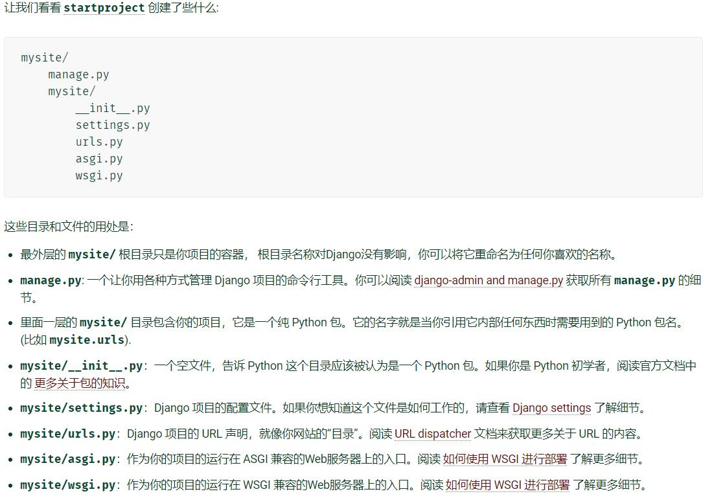
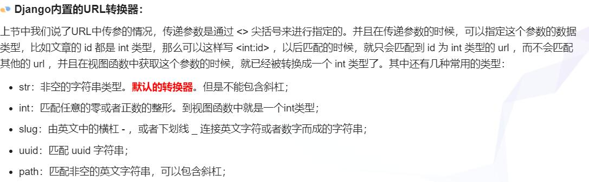

# Django Web开发 [Django文档](https://docs.djangoproject.com/zh-hans/3.0/)
### Django开发环境搭建
* Django安装 
> `pip install django`
* 创建工程
> `django-admin startproject mysite`


* 运行服务
> `python manage.py runserver 0.0.0.0:8000`(Ctrl+C暂停)
* 创建应用
> `python manage.py startapp myapp`
-----
## url路由设置
* path()设置
>```python
>from django.urls import include, path
>urlpatterns = [
>    path('index/', views.index, name='main-view'),
>    path('bio/<username>/', views.bio, name='bio'),
>    path('articles/<slug:title>/', views.article, name='article-detail'),
>    path('articles/<slug:title>/<int:section>/', views.section, name='article-section'),
>    path('weblog/', include('blog.urls')),
>    ...
>]
>```

* [python内置的url转换器](https://www.cnblogs.com/Carlos-Li/p/12090626.html)（可以将url中的参数传递到处理函数）


例如：

```python
from django.urls import path
from . import views

urlpatterns = [  
    path('book/<格式类型:参数名>/',视图函数)
    path('blog/page<int:num>/', views.page),
]

# View (views.py)
def page(request, num):
    对参数num进行处理
```

* re_path(正则表达式匹配)

```python

from django.urls import include, re_path

urlpatterns = [
    re_path(r'^index/$', views.index, name='index'),
    re_path(r'^bio/(?P<username>\w+)/$', views.bio, name='bio'),
    re_path(r'^weblog/', include('blog.urls')),
    ...
]

```

-----

## views设置(views.py设置)