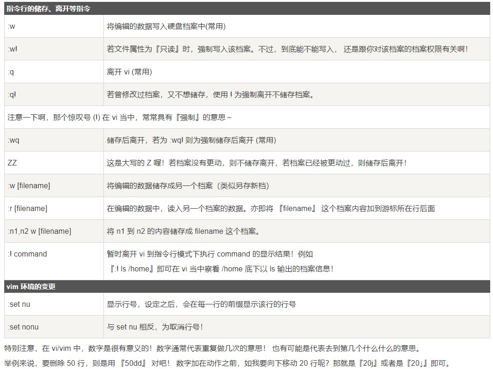
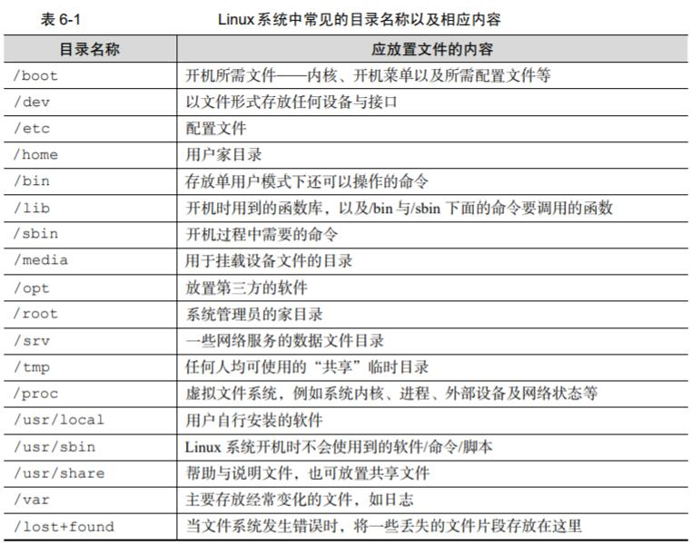
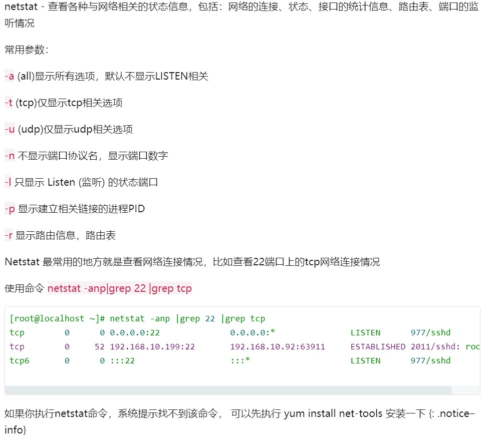
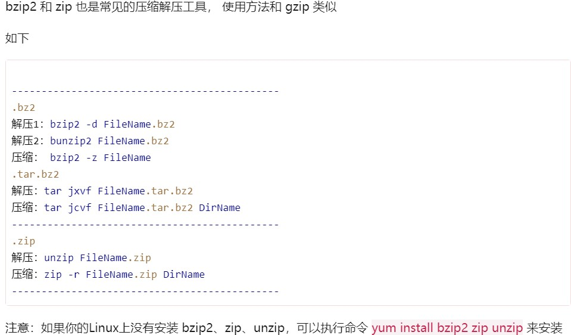

# Linux学习

--------------------------
## Vim(Vi)使用命令


* 命令模式（默认模式）
```
按0或^ － 光标移动到所在行的行首 
按$    － 光标移动到所在行的行尾
输入gg － 把光标移到文件开始位置
输入G  － 把光标移到文件末尾
输入Ctrl + f  －  往下翻一页
输入Ctrl + b  －  往上翻一页
按x  － 删除光标所在字符
按dd － 删除光标所在行
按dw － 删除光标所在处到词尾的内容
按d$ － 删除光标所在处到行尾的内容
按yy – 复制光标所在的行
按p – 黏贴
按v，然后移动光标，可以选择内容，再按y复制选中的内容
按u – 撤销刚才所做的操作
按Ctrl+r – 重做被撤销当前所做的操作
按. – 重复刚才所做的操作
```
* 底行命令模式命令

--------------------------

## 重定向和管道[🔗](http://www.python3.vip/tut/others/linux/07/)
> **```ps > out```** 输出屏幕重定向

> **```ps hhhh 2> err```** 输出错误重定向

>**```command &> both```** 输出错误和屏幕重定向到同一文件

>**```command > out 2> err```** 输出错误和屏幕重定向到不同文件

>**```python add.py < add.dat```** 输入重定向

>**```ps –ef | grep 6536```** 管道重定向
```
>是覆盖模式,>>是追加模式
```
--------------


## Linux软件安装
* 下载源代码包，编译安装(gcc编译安装)

1. 进入解压后的包执行软件配置与检查
>**```./configure```**

```
./configure --prefix=/usr/local/apache2
通过 -- prefix 定义源码包安装位置
```

2. 编译安装
执行编译make,将源码包编译为机器码,执行make install,安装
> **```make && make install```**
```
在linux中，&和&&,|和||介绍如下：
&  表示任务在后台执行，如要在后台运行redis-server,则有  redis-server &
&& 表示前一条命令执行成功时，才执行后一条命令 ，如 echo '1‘ && echo '2'    
| 表示管道，上一条命令的输出，作为下一条命令参数，如 echo 'yes' | wc -l
|| 表示上一条命令执行失败后，才执行下一条命令，如 cat nofile || echo "fail"
```

3. 安装完成之后,启动该服务（有的可能不需要）
```
我们通过查看源码包解压之后的目录 INSTALL 文件，可以知道启动命令
```
4. 包卸载
```
源码包不需要额外的卸载命令，直接删除安装目录即可，不会有任何的垃圾文件遗留
```
-------


## Linux包管理 [🔗](https://www.zhihu.com/collection/577076978)
* 常用的包管理工具

| 操作系统        | 格式 | 工具                             |
| --------------- | ---- | -------------------------------- |
| Debian / Ubuntu | .deb | apt , apt-cache , apt-get , dpkg |
| CentOS          | .rpm | yum                              |
| Arch            |      | pacman                           |
| Fedora          | .rpm | dnf                              |
| FreeBSD Ports   | .txz | make , pkg                       |


* 更新包列表

| 系统             | 命令                                                                 |
| ---------------- | -------------------------------------------------------------------- |
| Debian / Ubuntu  | ```sudo apt-get update```，```sudo apt update ```                    |
| CentOs           | ```yum check-update```                                               |
| Arch             | ```sudo pacman -Sy```，```sudo pacman -Su```，```sudo pacman -Syu``` |
| Fedora           | ```dnf check-update```                                               |
| FreeBSD Packages | ```sudo pkg update```                                                |
| FreeBSD Ports    | ```sudo portsnap fetch update```                                     |


* 从存储库安装包

| 系统             | 命令                                            | 说明                               |
| ---------------- | ----------------------------------------------- | ---------------------------------- |
|                  | ```sudo apt-get install package```              |
|                  | ```sudo apt-get install package1,package1...``` | 安装所有列出来的包                 |
| Debian / Ubuntu  | ```sudo apt-get install -y package```           | 在apt提示是否继续的地方直接默认yes |
|                  | ```sudo apt install package```                  | 显示一个彩色的进度条               |
|                  | ```sudo yum install package```                  |
| CentOS           | ```sudo yum install package1 package2 ...```    | 安装所有列出来的包                 |
|                  | ```sudo yum install -y package```               | 在yum提示是否继续的地方直接默认yes |
|                  | ```sudo dnf install package```                  |
| Fedora           | ```sudo dnf install packagel package2 ...```    | 安装所有列出来的包                 |
|                  | ```sudo dnf install -y package```               | 在dnf提示是否继续的地方直接默认yes |
|                  | ```sudo pkg install package```                  |
| FreeBSD Packages | ```sudo pkg install packagel package2...```     | 安装所有列出来的包                 |

* 从本地文件系统安装一个包

| 系统             | 命令                                                          | 说明                                                   |
| ---------------- | ------------------------------------------------------------- | ------------------------------------------------------ |
| Debian/Ubuntu    | ```sudo dpkg -i package.deb```                                |
|                  | ```sudo apt-get install -y gdebi && sudo gdebi package.deb``` | 安装gdebi,然后使用gdebi安装package.deb并处理缺失的依赖 |
| CentOs           | ```sudo yum install package.rpm ```                           |
| Fedora           | ```sudo dnf install package.rpm ```                           |
| FreeBSD Packages | ```sudo pkg add package.txz```                                |
|                  | ```sudo pkg add -f package.txz```                             | 即使已经安装的包也会重新安装                           |

* 删除一个或多个已安装的包

| 系统             | 命令                                               | 说明           |
| ---------------- | -------------------------------------------------- | -------------- |
|                  | ```sudo apt-get remove package```                  |                |
| Debian / Ubuntu  | ```sudo apt remove package```                      |
|                  | ```sudo apt-get autoremove```                      | 删除不需要的包 |
| CentOs           | ```sudo yum remove package```                      |
| Fedora           | ```sudo dnf erase package```                       |
| FreeBSD Packages | ```sudo pkg delete package```                      |                |
|                  | ```sudo pkg autoremove```                          | 删除不需要的包 |
| FreeBSD Ports    | ```sudo pkg delete package```                      |
|                  | ```cd /usr/ports/path_to_port && make deinstall``` | 卸载port       |

* apt命令

| 传统命令                      | 等价的apt命令                 |
| ----------------------------- | ----------------------------- |
| ```apt-get update```          | ```apt update```              |
| ```apt full-upgrade```        | ```apt-get dist-upgrade```    |
| ```apt-cache search string``` | ```apt search string```       |
| ```apt install package```     | ```apt-get install package``` |
| ```apt-get remove package```  | ```apt remove package```      |
| ```apt-get purge package```   | ```apt purge package```       |


* pacman 命令 详见[archlinux-wiki](https://wiki.archlinux.org/index.php/Pacman_(%E7%AE%80%E4%BD%93%E4%B8%AD%E6%96%87)#%E7%94%A8%E6%B3%95)

| 命令                                            | 解释                                                                                       |
| ----------------------------------------------- | ------------------------------------------------------------------------------------------ |
| 安装制定的包                                    |                                                                                            |
| ```pacamn -S package_name```                    | 安装或者升级单个软件包，或者一列软件包（包含依赖包）                                       |
| ```pacman -S $(pacman -Ssq package_regex)```    | 用正则表达式安装多个软件包                                                                 |
| ```pacman -S extra/package_name```              | 有时候在不同的软件仓库中，一个软件包有多个版本（比如[extra]和[testing]）可以选择一个来安装 |
| ```pacman -S plasma-{desktop,mediacenter,nm}``` | 安装多个含有相似名称的软件包，而并非整个包组或全部匹配的软件包                             |
| ```pacman -Sg gnome```                          | 想要查看哪些包属于gnome组                                                                  |

| 删除软件包                     | 说明                                                                                                               |
| ------------------------------ | ------------------------------------------------------------------------------------------------------------------ |
| ```pacman -R package_name```   | 删除单个软件包，保留其全部已经安装的依赖关系                                                                       |
| ```pacman -Rs package_name```  | 删除指定软件包，及其所有没有被其他已安装软件包使用的依赖关系                                                       |
| ```pacman -Rsc package_name``` | 要删除软件包和所有依赖这个软件包的程序(此操作是递归的，请小心检查，可能会一次删除大量的软件包)                     |
| ```pacman -Rdd package_name``` | 要删除一个被其他软件包依赖的软件包，但是不删除依赖这个软件包的其他软件包(此操作有破坏系统的能力，应该尽量避免使用) |
| ```pacman -Rn package_name```  | pacman 删除某些程序时会备份重要配置文件，在其后面加上*.pacsave扩展名。-n 选项可以避免备份这些文件                  |

| 升级软件包         | 说明                                                               |
| ------------------ | ------------------------------------------------------------------ |
| ```pacman -Syu```  | 升级整个系统,这个命令会同步非本地(local)软件仓库并升级系统的软件包 |
| ```pacman -Syyu``` | 强制升级                                                           |

| 查询包数据库                                                     | 说明                                                     |
| ---------------------------------------------------------------- | -------------------------------------------------------- |
| ```pacman -Q --help```                                           | 参数查询本地软件包数据库                                 |
| ```pacman -S --help```                                           | 查询远程同步的数据库                                     |
| ```pacman -Ss string1 string2 ...```                             | 在包数据库中查询软件包，查询位置包含了软件包的名字和描述 |
| ```pacman -Qs string1 string2 ...```                             | 查询已安装的软件包                                       |
| ```pacman -F string1 string2 ...```                              | 按文件名查找软件库                                       |
| ```pacman -Si package_name```                                    | 显示软件包的详尽的信息                                   |
| ```pacman -Qi package_name```                                    | 查询本地安装包的详细信息                                 |
| ```pacman -Qii package_name```                                   | 使用两个 -i 将同时显示备份文件和修改状态                 |
| ```pacman -Ql package_name```                                    | 获取已安装软件包所包含文件的列表                         |
| ```pacman -Fl package_name```                                    | 查询远程库中软件包包含的文件                             |
| ```pacman -Qk package_name```                                    | 检查软件包安装的文件是否都存在                           |
| ```pacman -Qo /path/to/file_name```                              | 查询数据库获取某个文件属于哪个软件包                     |
| ```pacman -F /path/to/file_name```                               | 查询文件属于远程数据库中的哪个软件包                     |
| ```pacman -Qdt```                                                | 罗列所有不再作为依赖的软件包(孤立orphans)                |
| ```pactree package_name```                                       | 显示软件包的依赖树                                       |
| ```pacman -Sc```                                                 | 清理软件包缓存                                           |
| ```pacman -Syu package_name1 package_name2 ...```                | 升级系统时安装其他软件包                                 |
| ```pacman -Sw package_name```                                    | 下载包而不安装它                                         |
| ```pacman -U /path/to/package/package_name-version.pkg.tar.xz``` | 安装一个本地包(不从源里下载）                            |
| ```pacman -U http://www.example.com/repo/example.pkg.tar.xz```   | 安装一个远程包（不在 pacman 配置的源里面）               |

```
pacman 的配置文件为 /etc/pacman.conf, 取消Color注释可以使用彩色输出。要查看旧版和新版的有效安装包，请取消/etc/pacman.conf中"VerbosePkgLists"的注释。
```


-----------
## Linux设备管理
* 常见的硬件设备及其文件名称

| 硬件设备       | 文件名称            |
| -------------- | ------------------- |
| IDE 设备       | /dev/hd[a-d]        |
| SCSI/SATA/U 盘 | /dev/sd[a-p]        |
| 软驱           | /dev/fd[0-1]        |
| 打印机         | /dev/lp[0-15]       |
| 光驱           | /dev/cdrom          |
| 鼠标           | /dev/mouse          |
| 磁带机         | /dev/st0 或/dev/ht0 |


* 一切从“/”开始


* 硬盘设备管理命令
>**```mount /dev/sdb2 /backup```**   挂载文件系统(先用mkdir创建目录)
```
如果想将文件系统为 ext4 的硬件设备/dev/sdb2 在开机后自动挂载到/backup 目录上，并
保持默认权限且无需开机自检，就需要在/etc/fstab 文件中写入下面的信息，这样在系统重启
后也会成功挂载。
```


| 命令                          | 说明     |
| ----------------------------- | -------- |
| **```umount /dev/sdb2```**    | 撤销挂载 |
| **```mkfs.ext4 /dev/sdb1```** | 格式化   |

* fdisk 命令中的参数以及作用

| 参数 | 作用                   |
| ---- | ---------------------- |
| m    | 查看全部可用的参数     |
| n    | 添加新的分区           |
| d    | 删除某个分区信息       |
| l    | 列出所有可用的分区类型 |
| t    | 改变某个分区的类型     |
| p    | 查看分区信息           |
| w    | 保存并退出             |
| q    | 不保存直接退出         |


------
## Linux常用命令
* 目录和文件操作命令

| 命令             | 说明                                     |
| ---------------- | ---------------------------------------- |
| **```pwd```**    | 查看当前目录                             |
| **```cd```**     | 改变当前目录（绝对路径和当前路径）       |
| **```touch```**  | 新建文件                                 |
| **```ls```**     | 查看目录内容 或者某个文件的属性 使用命令 |
| **```ls -l```**  | 查看详细信息                             |
| **```ls -a```**  | 查看所有文件（包括隐藏文件）             |
| **```makdir```** | 创建目录                                 |
| **```rm```**     | 删除文件                                 |
| **```rm -r```**  | 删除目录                                 |
| **```rm -f```**  | 不提示是否删除                           |
| **```cp```**     | 复制文件                                 |
| **```cp -r```**  | 复制目录                                 |
| **```mv```**     | 移动文件和目录                           |
| **```cat```**    | 查看文件内容                             |

-------

* 进程管理命令

| 命令                           | 说明                                                 |
| ------------------------------ | ---------------------------------------------------- |
| **```ps```**                   | 显示和当前终端有关的进程信息(PID进程ID PPID父进程ID) |
| **```ps -u byhy```**           | 显示byhy用户所创建的进程信息                         |
| **```ps -f```**                | 详细显示每个进程信息                                 |
| **```ps -e```**                | 显示所有正在运行的进程信息                           |
| **```ps -ef```**               | 显示当前系统所有的进程                               |
| **```python t2.py &```**       | 后台运行进程                                         |
| **```nohup python t2.py &```** | 后台运行进程,即使关闭了终端也不退出                  |
| **```Ctrl + C```**             | 强制结束前台进程                                     |

> **```ps –ef|grep python```**    使用管道符配合ps查找python进程                                      
------

* 网络管理命令

| 命令                              | 说明                            |
| --------------------------------- | ------------------------------- |
| **```ip addr```**                 | 查看所有网络接口                |
| **```ifup```**                    | 启用网络接口                    |
| **```ifdown```**                  | 禁用网络接口                    |
| **```ping```**                    | 检查网络连通性                  |
| **```ping www.baidu.com -t```**   | 一直发包                        |
| **```ssh 用户名@IP地址或域名```** | 登录远程机器ssh（secure shell） |
| **```scp```**                     | 拷贝文件                        |
| **```wget```**                     | 下载                            |

-----



--------

* 启动、重启、关闭、查看服务

| 命令                               | 说明               |
| ---------------------------------- | ------------------ |
| **```service mysqld status```**    | 查看 MySQL服务状态 |
| **```service mysqld start```**     | 启动MySQL服务      |
| **```service mysqld restart```**   | 重启MySQL服务      |
| **```service mysqld stop```**      | 停止MySQL服务      |
| ----                               | ----               |
| **```systemctl status mysqld```**  | 查看 MySQL服务状态 |
| **```systemctl start mysqld```**   | 启动MySQL服务      |
| **```systemctl restart mysqld```** | 重启MySQL服务      |
| **```systemctl stop mysqld```**    | 停止MySQL服务      |
| **```systemctl enable mysqld```**  | MySQL服务开机自启  |
| **```systemctl disable mysqld```**  | 停止MySQL服务开机自启  |
| **```systemctl is-enabled mysqld```**  | 查看服务是否开机启动  |
| **```systemctl list-unit-files```**  | 查看已启动的服务列表  |
| **```systemctl --failed```**  | 查看启动失败的服务列表  |


-------
* 打包与压缩（v可以可不要，仅显示过程）

| 命令                              | 说明         |
| --------------------------------- | ------------ |
| **```tar cvf 1.txt 2.txt```**     | 打包         |
| **```tar xvf file.tar```**        | 解包         |
| **```tar tvf file.tar```**        | 查看包内容   |
| **```tar rvf file.tar 3.txt```**  | 添加文件到包 |
| **```gzip 1.txt```**              | 压缩文件     |
| **```gzip -d 1.gz```**            | 解压文件     |
| **```tar zcvf 1.tar.gz 1.txt```** | 打包并压缩   |
| **```tar zxcf 1.tar.gz```**       | 解包并解压缩 |
------


