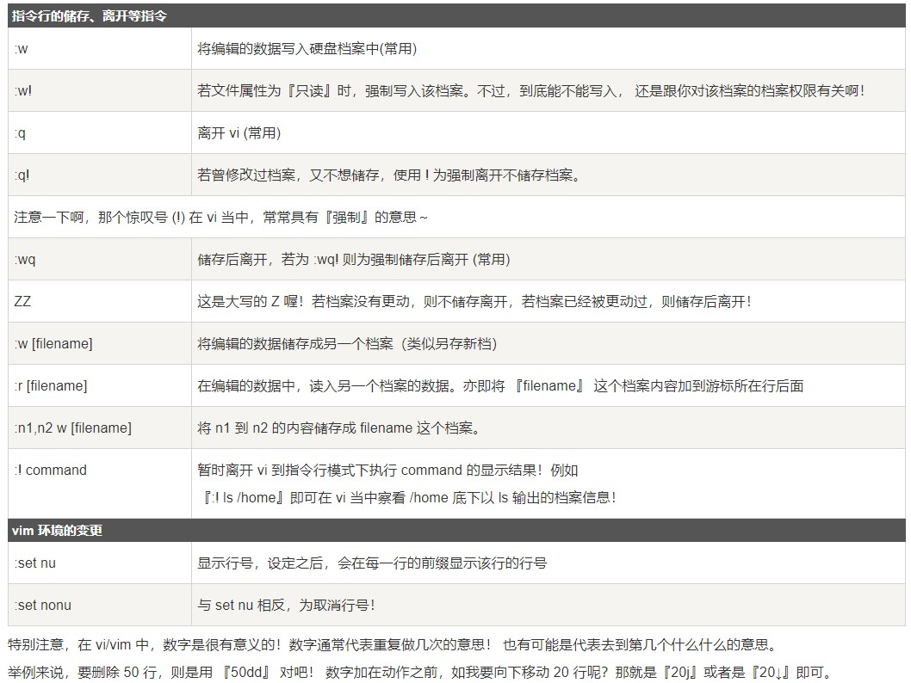
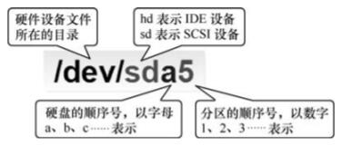
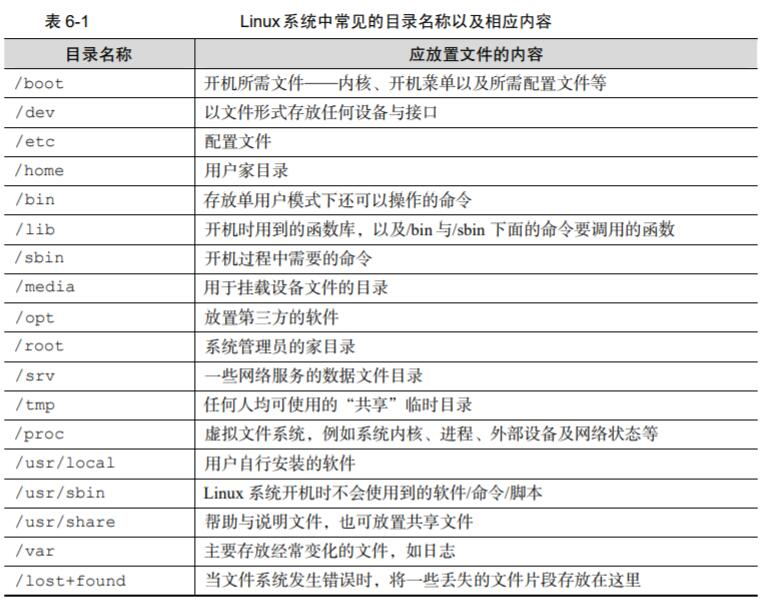
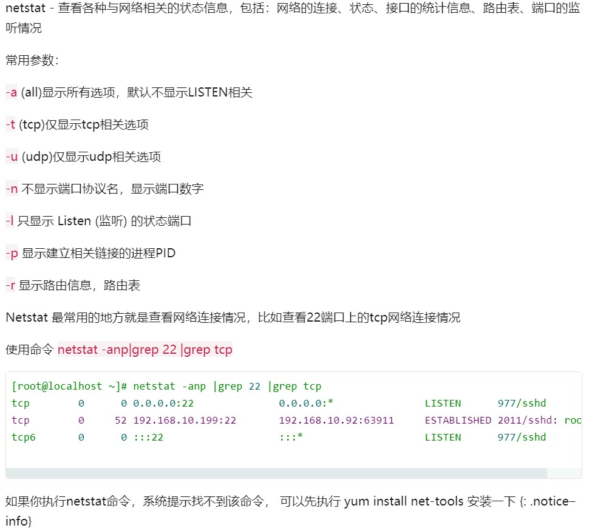

# Linux学习

--------------------------
## Vim(Vi)使用命令


* 命令模式（默认模式）
```
按0或^ － 光标移动到所在行的行首 
按$    － 光标移动到所在行的行尾
输入gg － 把光标移到文件开始位置
输入G  － 把光标移到文件末尾
输入Ctrl + f  －  往下翻一页
输入Ctrl + b  －  往上翻一页
按x  － 删除光标所在字符
按dd － 删除光标所在行
按dw － 删除光标所在处到词尾的内容
按d$ － 删除光标所在处到行尾的内容
按yy – 复制光标所在的行
按p – 黏贴
按v，然后移动光标，可以选择内容，再按y复制选中的内容
按u – 撤销刚才所做的操作
按Ctrl+r – 重做被撤销当前所做的操作
按. – 重复刚才所做的操作
```
* 底行命令模式命令

--------------------------

## 重定向和管道[🔗](http://www.python3.vip/tut/others/linux/07/)
> **ps > out** 输出屏幕重定向

> **ps hhhh 2> err** 输出错误重定向

>**command &> both** 输出错误和屏幕重定向到同一文件

>**command > out 2> err** 输出错误和屏幕重定向到不同文件

>**python add.py < add.dat** 输入重定向

>**ps –ef | grep 6536** 管道重定向
```
>是覆盖模式,>>是追加模式
```
--------------


## Linux软件安装
* 下载源代码包，编译安装(gcc编译安装)

1. 进入解压后的包执行软件配置与检查
>**./configure**

```
./configure --prefix=/usr/local/apache2
通过 -- prefix 定义源码包安装位置
```

2. 编译安装
执行编译make,将源码包编译为机器码,执行make install,安装
> **make && make install**
```
在linux中，&和&&,|和||介绍如下：
&  表示任务在后台执行，如要在后台运行redis-server,则有  redis-server &
&& 表示前一条命令执行成功时，才执行后一条命令 ，如 echo '1‘ && echo '2'    
| 表示管道，上一条命令的输出，作为下一条命令参数，如 echo 'yes' | wc -l
|| 表示上一条命令执行失败后，才执行下一条命令，如 cat nofile || echo "fail"
```

3. 安装完成之后,启动该服务（有的可能不需要）
```
我们通过查看源码包解压之后的目录 INSTALL 文件，可以知道启动命令
```
4. 包卸载
```
源码包不需要额外的卸载命令，直接删除安装目录即可，不会有任何的垃圾文件遗留
```


-----------
## Linux设备管理
* 常见的硬件设备及其文件名称

| 硬件设备       | 文件名称            |
| -------------- | ------------------- |
| IDE 设备       | /dev/hd[a-d]        |
| SCSI/SATA/U 盘 | /dev/sd[a-p]        |
| 软驱           | /dev/fd[0-1]        |
| 打印机         | /dev/lp[0-15]       |
| 光驱           | /dev/cdrom          |
| 鼠标           | /dev/mouse          |
| 磁带机         | /dev/st0 或/dev/ht0 |


* 一切从“/”开始


* 硬盘设备管理命令
>**mount /dev/sdb2 /backup** 挂载文件系统(先用mkdir创建目录)
```
如果想将文件系统为 ext4 的硬件设备/dev/sdb2 在开机后自动挂载到/backup 目录上，并
保持默认权限且无需开机自检，就需要在/etc/fstab 文件中写入下面的信息，这样在系统重启
后也会成功挂载。
```

>**umount /dev/sdb2** 撤销挂载

>**mkfs.ext4 /dev/sdb1** 格式化

* fdisk 命令中的参数以及作用

| 参数 | 作用                   |
| ---- | ---------------------- |
| m    | 查看全部可用的参数     |
| n    | 添加新的分区           |
| d    | 删除某个分区信息       |
| l    | 列出所有可用的分区类型 |
| t    | 改变某个分区的类型     |
| p    | 查看分区信息           |
| w    | 保存并退出             |
| q    | 不保存直接退出         |


------
## Linux常用命令
* 目录和文件操作命令
> **pwd** 查看当前目录
 
> **cd** 改变当前目录（绝对路径和当前路径）

>**touch** 新建文件

>**ls** 查看目录内容 或者某个文件的属性 使用命令

>**ls -l** 查看详细信息

>**ls -a** 查看所有文件（包括隐藏文件）

>**makdir** 创建目录

>**rm** 删除文件

>**rm -r** 删除目录

>**rm -f** 不提示是否删除

>**cp** 复制文件

>**cp -r** 复制目录

>**mv** 移动文件和目录

>**cat** 查看文件内容

-------

* 进程管理命令

>**ps** 显示和当前终端有关的进程信息（PID进程ID PPID父进程ID）

>**ps -u byhy** 显示byhy用户所创建的进程信息

>**ps -f** 详细显示每个进程信息

>**ps -e** 显示所有正在运行的进程信息

>**ps -ef** 显示当前系统所有的进程

>**ps –ef|grep python** 查找python进程

>**python t2.py &** 后台运行进程

>**nohup python t2.py &** 后台运行进程,即使关闭了终端也不退出

>**Ctrl + C** 强制结束前台进程

------

* 网络管理命令
> **ip addr** 查看所有网络接口

>**ifup** 启用网络接口

>**ifdown** 禁用网络接口

>**ping** 检查网络连通性

>**ping www.baidu.com -t** 一直发包

>**ssh  用户名@IP地址或域名** 登录远程机器ssh（secure shell）

>**scp** 拷贝文件

>**wget** 下载

-----



--------

* 启动、重启、关闭、查看服务

>**service mysqld status**  查看 MySQL服务状态

>**service mysqld start**  启动MySQL服务

>**service mysqld restart**  重启MySQL服务

>**service mysqld stop**  停止MySQL服务
------
>**systemctl status mysqld** 查看 MySQL服务状态

>**systemctl start mysqld** 启动MySQL服务

>**systemctl restart mysqld** 重启MySQL服务

>**systemctl stop mysqld** 停止MySQL服务

>**systemctl enable mysqld** MySQL服务开机自启
-------
* 打包与压缩（v可以可不要，仅显示过程）
>**tar cvf 1.txt 2.txt** 打包

>**tar xvf file.tar** 解包

>**tar tvf file.tar** 查看包内容

>**tar rvf file.tar 3.txt** 添加文件到包

>**gzip 1.txt** 压缩文件

>**gzip -d 1.gz** 解压文件

>**tar zcvf 1.tar.gz 1.txt** 打包并压缩

>**tar zxcf 1.tar.gz** 解包并解压缩
------


